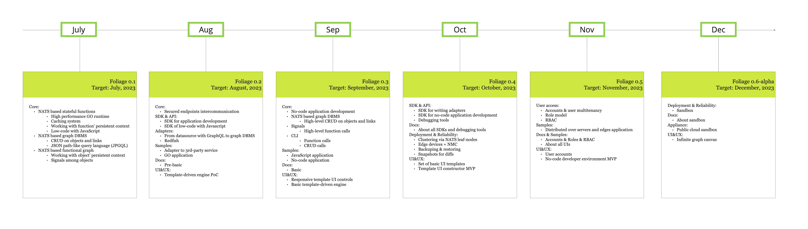

<p align="center">
  
</p>

Foliage is a collaborative application platform built upon a distributed graph database, providing a unified and extensible environment for effortless automation, cross-domain connectivity, and high-performance, edge-friendly runtimes.

[![License][License-Image]][License-Url] ![Lint][Lint-Status-Image-Url]

[License-Url]: https://www.apache.org/licenses/LICENSE-2.0
[License-Image]: https://img.shields.io/badge/License-Apache2-blue.svg
[Lint-Status-Image-Url]: https://github.com/foliagecp/sdk/actions/workflows/golangci-lint.yml/badge.svg

## Table of Contents

- [Core concepts](#core-concepts)
  - [Abstraction](#abstraction)
  - [Features](#features)
- [Getting Started](#getting-started)
  - [Included tests runtime](#included-tests-runtime)
    - [1. Go to `tests` dir](#1-go-to-tests-dir)
    - [2. Build tests runtime](#2-build-tests-runtime)
    - [3. Modify .env file](#3-modify-env-file)
    - [4. Run](#4-run)
    - [5. Stop \& clean](#5-stop--clean)
    - [6. Test samples and customization](#6-test-samples-and-customization)
  - [Develop using the SDK](#develop-using-the-sdk)
- [Stack](#stack)
- [Roadmap](#roadmap)
- [References](#references)
- [License](#license)

# Core concepts
The primary concept of Foliage, as a high-performance application platform, revolves around orchestrating the collaborative work and interactions of complex and heterogeneous software and information systems. The platform's technology is rooted in the theory of heterogeneous functional graphs.

## Abstraction
Knowledge about a complex or compound system, previously stored separately, converges into a unified associative space. This enables transparent understanding of the entire system and its behavior as an inseparable whole. It also provides the capability to consider all hidden relationships and previously unpredictable features, blurring the boundary between the system model and the system itself. 


Foliage achieves transparency, consistency, and unambiguity among related system components by consolidating knowledge from different domain planes into a unified space. It uncovers previously unnoticed dependencies, some of which might have been known only to a DevOps engineer or hidden within a script. This capability enables a transparent evaluation of the entire system and facilitates the addition of new links and relationships that were challenging to implement due to the functional rigidity of the software.


## Features
Explore the extensive list of features [here](./docs/features.md).

# Getting Started
```sh
git clone https://github.com/foliagecp/sdk.git
```
For detailed documentation, please visit the [official docs](https://pkg.go.dev/github.com/foliagecp/sdk).

## Included tests runtime
### 1. Go to `tests` dir
```
cd tests
```
### 2. Build tests runtime
```sh
docker-compose build
```

### 3. Modify .env file
Modify the `.env` file for the test you intend to run. For the basic test, it's located at `./basic/.env`.

### 4. Run
```sh
docker-compose up -d
```
By default the test `basic` sample will be started. To choose another test sample use:
```
export TEST_NAME=<name> && docker-compose up -d
```

### 5. Stop & clean
```sh
docker-compose down -v
```

### 6. Test samples and customization 
To gain a better understanding of the principles of development with Foliage, explore the existing test samples and learn how to customize them. Below is a list of test samples provided with the SDK: 
- [Basic](./docs/tests/basic.md)

For no-code/low-code statefun logic definition the following plugins are available:
- [JavaScript](./docs/plugins/js.md)

## Develop using the SDK

```sh
go get github.com/foliagecp/sdk
```

1. [Find out how to work with the graph](./docs/graph_crud.md)
2. [Foliage's Json Path Graph Query Language](./docs/jpgql.md)
3. [Write your own application](./docs/how_to_write_an_application.md)
4. [Measure performance](./docs/performance_measures.md)

# Stack
1. Backend
    - Jetstream NATS
    - Key/Value Store NATS
    - WebSocket NATS
    - GoLang
    - JavaScript (V8)
2. Frontend
    - React
    - Typescript/JavaScript
    - WebSocket
3. Common
    - docker
    - docker-compose

[Why NATS?](./docs/technologies_comparison.md)

# Roadmap


Explore our exciting roadmap for upcoming features and enhancements.

# References
- [Thesaurus](./docs/thesaurus.md)
- [Conventions](./docs/conventions.md)

# License
Unless otherwise noted, the Foliage source files are distributed
under the Apache Version 2.0 license found in the LICENSE file.


