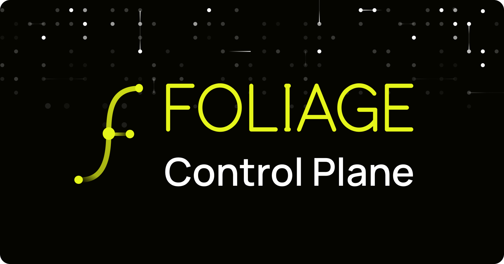
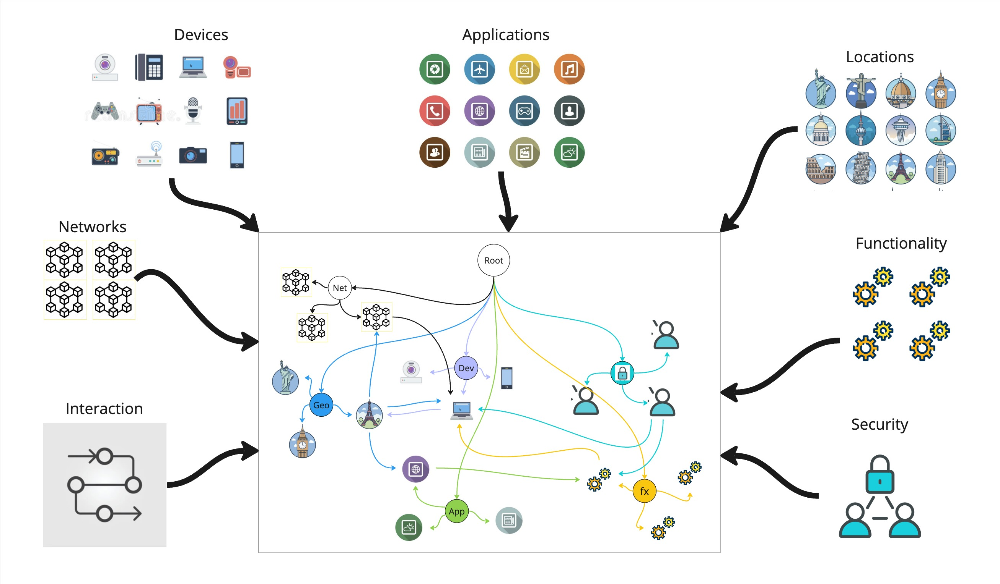
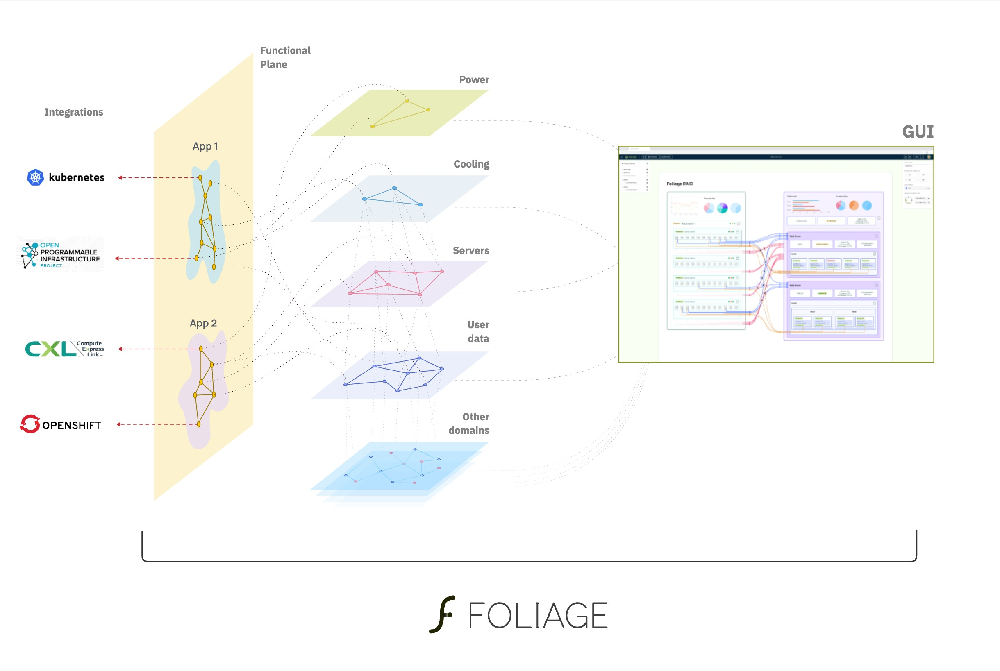

# Foliage SDK

<p align="center">
  
</p>

[Foliage](https://www.foliage.dev/) is a collaborative application platform built upon a distributed graph database, providing a unified and extensible environment for effortless automation, cross-domain connectivity, and high-performance, edge-friendly runtimes.

[![License][License-Image]][License-Url] ![Lint][Lint-Status-Image-Url]

[License-Url]: https://www.apache.org/licenses/LICENSE-2.0
[License-Image]: https://img.shields.io/badge/License-Apache2-blue.svg
[Lint-Status-Image-Url]: https://github.com/foliagecp/sdk/actions/workflows/golangci-lint.yml/badge.svg

## Table of Contents

- [Introduction](#introduction) <!-- omit in toc -->
- [Core Concepts](#core-concepts)
  - [Abstraction](#abstraction)
  - [Features](#features)
- [Getting Started](#getting-started)
  - [Installation](#installation)
  - [Running Tests](#running-tests) 
  - [Customization](#customization)
- [Development](#development)
  - [Working with the SDK](#working-with-the-sdk)
- [Technology Stack](#technology-stack)
- [Roadmap](#roadmap)
- [References](#references)
- [License](#license)
- [Contribution](#contribution)

## Introduction

Foliage is an open-source collaborative application platform that leverages a distributed graph database. It provides a unified and extensible environment for automation, cross-domain connectivity, and high-performance, edge-friendly runtimes. Whether you're building IoT solutions, automation workflows, or edge computing applications, Foliage offers a powerful foundation.

## Core Concepts

### Abstraction

Foliage introduces the concept of abstraction, where knowledge about complex systems converges into a unified associative space. This enables transparent understanding of the entire system, blurring the boundary between system models and the system itself.



### Features

Foliage offers transparency, consistency, and unambiguity among system components by consolidating knowledge from different domains into a unified space. It uncovers previously unnoticed dependencies, making system evaluation and relationship management more straightforward.



For a comprehensive list of features, see [here](./docs/features.md).

## Getting Started

### Installation

To get started with Foliage, clone the repository:

```sh
git clone https://github.com/foliagecp/sdk.git
```

For detailed installation instructions and prerequisites, visit the [official documentation](https://pkg.go.dev/github.com/foliagecp/sdk).

### Running Tests

Foliage provides a set of test samples to help you get familiar with the platform. To run tests, follow these steps:

#### 1. Navigate to the `tests` directory:

```sh
cd tests
```

#### 2. Build the tests runtime:

```sh
docker-compose build
```

#### 3. Modify the `.env` file:

Customize the test environment by editing the `.env` file. For the basic test, find it at `./basic/.env`.

#### 4. Start the tests:

```sh
docker-compose up -d
```

By default, the basic test sample will start. To choose another test sample, set the `TEST_NAME` environment variable before running `docker-compose up -d`.

#### 5. Stop and clean up:

When you're done testing, stop and clean up the environment:

```sh
docker-compose down -v
```

### Customization

Explore existing test samples and learn how to customize them to better understand Foliage's development principles. Refer to the [basic test sample documentation](./docs/tests/basic.md).

For statefun logic definition, consider using plugins like [JavaScript](./docs/plugins/js.md).

## Development

### Working with the SDK

To develop applications with Foliage, use the SDK:

```sh
go get github.com/foliagecp/sdk
```

- Learn to work with the graph [here](./docs/graph_crud.md)
- Explore Foliage's JSON Path Graph Query Language (JPGQL) [here](./docs/jpgql.md)
- Find out how to write your own application [here](./docs/how_to_write_an_application.md)
- Measure performance with guidance [here](./docs/performance_measures.md)

## Technology Stack

Foliage relies on a versatile technology stack that includes:

- Backend
  - Jetstream NATS
  - Key/Value Store NATS
  - WebSocket NATS
  - GoLang
  - JavaScript (V8)
- Frontend
  - React
  - TypeScript/JavaScript
  - WebSocket
- Common
  - Docker
  - Docker Compose

[Learn more about our technology choices](./docs/technologies_comparison.md).

## Roadmap

Explore our exciting roadmap for upcoming features and enhancements by checking out the [Roadmap](./docs/pics/Roadmap.jpg).

## References

- [Glossary](./docs/glossary.md)
- [Conventions](./docs/conventions.md)

## License

Unless otherwise noted, the Foliage source files are distributed under the Apache Version 2.0 license found in the LICENSE file.

## Contribution

Foliage welcomes contributions from the open-source community. Join us in building a collaborative application platform that empowers developers worldwide.