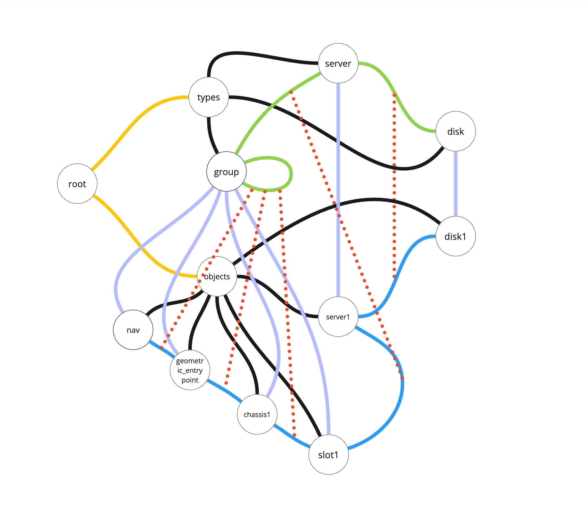

# Conventions
## Graph schema convention
Graph data about a system should be stored in a uniform way as shown on the picture below.

### 1. Vertex `root`
Vertice's id=`root`. Always exists. The root entrypoint into the graph. Always has only 2 out links:
1. Link of type `__types` leading to vertex with id=`types`
2. Link of type `__objects` leading to vertex with id=`types`  
No body required.

### 2. Vertex `types`
Vertice's id=`types`. Has out links typed `__type` to all vertices representing object types (type-vertex). Each such link should have a tag `name_<to_type_name>`, where `to_type_name` is the name of a type the link is leading to.  
No body required.

### 3. Type-vertex `group`
Only exists if grouping is planned. Represents the scpecial `group` type. Has out links typed `__object` to all object-vertices representing a group. Always has link to itself representing the ability of objects of type `group` to connect with each other (grouping another groups). May have out links to other type-vertices.  
May have body that declares meta info and rules for group objects.

### 4. Type-vertex
For e.g. `server`, `disk`, `group` from the picture above.  
Vertex that contains all info about a type it represents. Has out links typed `__object` to all object-vertices of its type. May have out links to other type-vertices.  
May have body that declares meta info and rules for such typed objects.

### 5. Vertex `objects`
Vertice's id=`objects`. Has out links typed `__object` to all vertices representing objects (object-vertex). Each such link should have a tag `name_<to_object_name>`, where `to_object_name` is the name of an object the link is leading to.  
No body required.

### 6. Object-vertex `nav`
Only exists if topology navigation is planned. Represents the scpecial object of `group` type. Has out links all object-vertices of type `group` (defined in the body of link `group->group`) representing a topology entrypoint. Always has link to type-vertex `group`. May have out links to other type-vertices. Represent the entrypoint for topology navigation via JPGQL.  
No body required.

### 4. Object-vertex
For e.g. `server1`, `disk1`, `nav` from the picture above.  
Vertex that contains all info about an object it represents. Has out link typed `__type` to a type-vertex representing its type. May have out links to other object-vertices (type of a link from object-vertex A to object-vertex B should be defined in the body of a link from type-vertex TypeA to type-vertex TypeB).  
Body contains all neccesery info about an object.